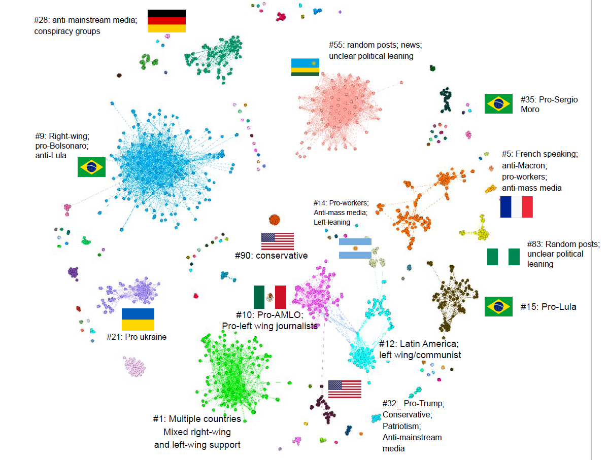

---
---
---

# **Detecting Coordinated Link Sharing Behaviour with CooRnet**


Welcome to the code and data repository for the "Detecting Coordinated Link Sharing Behaviour with [CooRnet](https://coornet.org/)" tutorial at the [Digital Media Initiative 2023 Winter School](https://wiki.digitalmethods.net/Dmi/WinterSchool2023). The results of the related project "Mapping Coordinated Networks That Circulate Problematic Information on the war in Ukraine" are available at [this page](https://wiki.digitalmethods.net/Dmi/WinterSchool2023coornet4ukraine). The project was supported by [vera.ai](https://www.veraai.eu/) grant.

This documentation is also available in [PDF format](./downloads/tutorial_documentation.pdf). The presentation used during the tutorial is also available [here](./downloads/presentation.pdf).

## Abstract

In this tutorial, we use CooRnet - a tool developed in R for detecting coordinated link-sharing behaviour (CLSB) - to map networks of problematic social media actors that shared posts on the Ukraine War. Coordinated link sharing is a type of online manipulation in which a group of individuals or organizations work together to amplify the visibility of certain content on social media platforms. CooRnet allows users to analyze the link-sharing patterns and detect groups of accounts that exhibit coordinated behaviour. The tutorial will cover the basics of using CooRnet, including how to install and load the package, where to find and how to prepare input data, and how to interpret and visualize the output. By the end of this tutorial, users will have a solid understanding of how to use CooRnet to detect coordinated link-sharing behaviour on Facebook.

The tutorial will cover the following topics:

-   Online Coordinated Inauthentic Behaviour, what it is and why it is a problem.

-   Leveraging CrowdTangle data to detect CLSB on Facebook.

-   CooRnet functions, implementation of CLSB concepts.

-   Analysis and interpretation of CooRnet's output.

-   Open problems and current challenges of CIB.

## Summary

1.  Definitions: from CiB to CLSB;

2.  Getting started: the [[Global CLSB \> List]{.underline}](https://github.com/fabiogiglietto/Global_CLSB);

3.  Created two new CrowdTangle lists with groups and Pages (bulk \> import);

4.  Collected all the posts created by these accounts from 2022-02-20 \> 23:59:59 CET to 2022-12-03 23:59:59 CET with a set of Ukraine \> invasion keywords (Ukraine, Russia, Putin, Zelensky, Kiev, \> Zaporizhzhia, Donetsk, Mariupol, Kharkiv, Kherson, Luhans'k, \> Luhansk, Saporischschja, Donezk, Charkiw);

5.  From the CrowdTangle CSV, extracted all the links in the posts by \> using CooRnet::get_urls_from_ct_histdata (total URLs 31,578);

6.  Used this list of URLs to retrieve all the Facebook/Instagram shares \> of these URLs (all posts that shared these URLs) using \> CooRnet::get_ctshares.R function (total CT shares 1,128,826);

7.  Detected 2,501 coordinated accounts organized in 161 clusters by \> analyzing the dataset of shares using CooRnet::get_coord_shares \> function;

8.  Output extraction and exploration;

9.  CLSB map of Ukraine Invasion (show the map).

## Implementation

### Disinformation during the Ukraine invasion

Misinformation and war have historically coexisted as two interrelated phenomena [1]. In addition to confronting on the battlefield, the opponents in warfare strive to control information in order to encourage their side and influence public opinion. Tactics to spread misinformation have been weaponized to pursue political and military objectives. Especially in recent years with the rise of information technologies distribution, profound changes occurred in the ways dis/misinformation intersects with warfare events as both the channels by which information can be disseminated and the actors who can disseminate it have grown in number and multiplicity [2]. The ongoing conflict between Russia and Ukraine represents an interesting case study to analyze online mis/disinformation in a context of a modern warfare, especially because - as documented by various reports and studies [3] - Russia has long used mis/disinformation to destabilize crisis areas and interfere with democratic processes. Before the military conflict, Russia had been laying the groundwork for weeks by disseminating false claims regarding treatment of the Donbass population by the Ukrainian government [4]. After the invasion occurred in February 2022, many scholars and journalists have observed a rise in the spread of problematic information across the world. From the presence of biological weapons in Ukraine to the genocide of Russian-speakers in Donbass, there were a number of debunked narratives conveyed by Russian propaganda tools, through a network of media close to or directly controlled by the government [5]. In light of these manipulative attempts, Western institutions or international debunking organizations put a lot of efforts in countering Russian propaganda by blocking [problematic websites](https://www.consilium.europa.eu/en/press/press-releases/2022/03/02/eu-imposes-sanctions-on-state-owned-outlets-rt-russia-today-and-sputnik-s-broadcasting-in-the-eu/) or through fact checking activities (see for example [EUvsDisinfo](https://euvsdisinfo.eu/it/) or ["EDMO War in Ukraine"](https://edmo.eu/war-in-ukraine-the-fact-checked-disinformation-detected-in-the-eu/)). However, although the work of debunking individual narratives is a valuable tool for combating misinformation, the fuzziness of the phenomenon and the frequency at which malicious actors change their strategies requires different tools that focus on the sources that spread misinformation. In fact, very often problematic content is spread widely on social media through networks of accounts that act in a coordinated manner, i.e., when multiple accounts share the same content simultaneously. Considering the briefly described informative scenario about the Russian-Ukrainian conflict, the goal of this project is to identify and map networks of accounts around the world that share problematic information regarding it.

## Procedure

1.  *Definitions: from CIB to CLSB*

Coordinated Inauthentic Behavior (CiB) is a term used by Meta (previously Facebook) to describe efforts to use the social media platform to "manipulate public debate for a strategic goal where fake accounts are central to the operation". The term first surfaced at the end of 2018 along an explicatory video in which Nathaniel Gleicher - Head of Facebook Cybersecurity Policy - provides an initial definition of the concept. In more recent documentation, CiB is "defined as the use of multiple Facebook or Instagram assets, working in concert to engage in Inauthentic Behavior, where the use of fake accounts is central to the operation". According to this documentation, Facebook or Instagram assets (accounts, pages, groups, or events) that mislead people about their identity, popularity, purpose or origin are violating the policy on Inauthentic Behavior [6].

Coordinated Link Sharing Behaviour (CLSB) is a form of CiB activity performed by a network of social media accounts (e.g. Facebook Pages/Groups) that repeatedly share the same link in a very short period of time from each other.

The rationale is that, while it may be common that several accounts share the same URLs, it is unlikely, unless a consistent coordination exists, that this occurs within a very short period of time and repeatedly. Repeated rapid co-sharing is thus the core logic of CSLB detection.

CooRnet is an R package that detected CLSB.

2.  *Getting Started: the Global CLSB List*

In a previous work - [Global CLSB maps 2022](https://datastudio.google.com/reporting/88925379-9971-4c0a-aef8-93c6e0b006a4/page/8HsWB?s=h1CRz1_T37I) - we identified 818 coordinated accounts (115 Facebook Pages and 703 public groups organized in 95 networks](<https://github.com/fabiogiglietto/Global_CLSB>)) that performed "coordinated link sharing behavior" on Facebook by rapidly sharing at least four different news stories rated as problematic by Facebook third-party fact-checkers between January 2017 and December 2021. We consider this list a useful starting point for searching for problematic information related to the Russian/Ukrainian conflict because the accounts on this list have previously disseminated problematic information on Facebook.

3.  *CrowdTangle lists*

Through [CrowdTangle](https://www.crowdtangle.com/) (CT), it is possible to trace all the content posted by these pages in a given time frame and check whether they actually posted content related to the Russian/Ukrainian conflict. To do this, it can be useful to create a [list](https://help.crowdtangle.com/en/articles/1140912-what-is-a-list) - namely a collection of specific Pages, Groups, or public accounts - that enable users to monitor and compare the content accounts through different functions. Since CrowdTangle does not allow you to create unique lists for pages and groups, it is necessary to create 2 different lists: one for groups and the other for pages.

Through CrowdTangle's ["Batch Upload"](https://help.crowdtangle.com/en/articles/2489675-faq-lists#:~:text=To%20do%20this%2C%20click%20on,account%2Fsubreddit%20you%20are%20adding.) function, we created a list composed of 115 pages and another one composed of 682 groups.

4.  *Collecting posts*

Once the lists have been created, we can use CrowdTangle's "search" function to retrieve published posts from the analyzed pages. According to our goals, keyword research over a specified period of time may be functional. For example, we can use the keywords "*Ukraine, Russia, Putin, Zelensky, Kiev, Zaporizhzhia, Donetsk, Mariupol, Kharkiv, Kherson, Luhans'k, Luhansk, Saporischschja, Donezk, Charkiw*" from 2022-02-20 23:59:59 CET - 2022-12-03 23:59:59 CET).

CrowdTangle will email a CSV file with the requested data ([a list of posts](https://github.com/fabiogiglietto/CooRnet_at_DMI_WS_2023/blob/main/rawdata/allposts.csv)). We can either download this file or save the link for later.

We then start our R Studio, create a new project and install the [CooRnet package](https://coornet.org/tutorial01.html).

```{r}
library("readr")
library("CooRnet")

# setup working spaces with data and rawdata folders
dir.create("./data/")
dir.create("./rawdata/")

# set the link to CrowdTangle CSV file\

allpostsfile <- "https://github.com/fabiogiglietto/CooRnet_at_DMI_WS_2023/blob/main/rawdata/allposts.csv?raw=true"


# un-comment the following lines if you want to inspect the CSV file
# df <- read.csv(allpostsfile)
# names(df)
# head(df)

urls <- CooRnet::get_urls_from_ct_histdata(ct_histdata_csv = allpostsfile,
                                           newformat = TRUE)

nrow(urls) # get the number of URLs
names(urls) # list the columns name
write.csv(urls, "./data/urls.csv") # save the list of URLs on disk
```

6.  *Retrieving Facebook posts that shared our links*

With our new "urls" data.frame loaded, we can now call the "get_ctshares" function to get a list of posts that link or mention these URLs. We set the "clean_urls" equal TRUE for cleaning the URLs from the tracking parameters and keeping, whenever possible, just the canonical form of the URL. We also set the "get_history" parameter to FALSE to avoid collecting unnecessary fine-grained performance data about our posts.

```{r}
ct_shares.urls <- CooRnet::get_ctshares(urls,
                                        sleep_time = 1,
                                        get_history = FALSE,
                                        clean_urls = TRUE)

# un-comment the following line to load the rds file from disk
# ct_shares.urls <- readRDS("./data/ct_shares.rds")

nrow(ct_shares.urls) # 1,128,826 posts
saveRDS(ct_shares.urls, "./data/ct_shares.rds") # save the posts on disk
```

7.  *Detecting and marking coordinated shares*

A key concept of CooRnet is the coordination interval. The coordination intervals define what we consider a rapid co-share. There is a helper function that attempts estimating the most appropriate interval for your dataset.

```{r}
CooRnet::estimate_coord_interval(ct_shares.df = ct_shares.urls) # 23 secs
```

Now, we use the "get_coord_shares" function to obtain the list of the accounts that shared the URLs in a coordinated way. We set the "parallel" option to TRUE to use parallel computing and speed up the process, the "clean_urls" equal TRUE to clean the URLs from the tracking parameters so as to avoid two identical links are recognized as different just because of the presence of unnecessary parameters, and the "keep_ourl_only" equal TRUE to be sure to limit the analysis to the original URLs we started from.

```{r}
### 0.995
dir.create("./data/995_23") # creates a directory for our outputs

output <- CooRnet::get_coord_shares(ct_shares.df = ct_shares.urls,
                                    coordination_interval = "23 secs",
                                    parallel = FALSE,
                                    percentile_edge_weight = 0.995,
                                    keep_ourl_only = TRUE,
                                    clean_urls = TRUE)

# un-comment the following line to load the output file from disk
# output <- readRDS("./data/output_0995_23.rds")

saveRDS(output, "./data/output_0995_23.rds")
```

8.  *Output extraction and exploration*

Finally, we can use the "get_outputs" function to access the results of the function. There are several files that can be obtained, allowing different analyses of the data.

```{r}
CooRnet::get_outputs(coord_shares_output = output,
                     component_summary = TRUE,
                     cluster_summary = TRUE, 
                     top_coord_share = TRUE,
                     top_coord_urls = TRUE)

# save highly_connected_coordinated_entities in .CSV format for further analysis
readr::write_csv(highly_connected_coordinated_entities, file = "./data/995_23/highly_connected_coordinated_entities.csv")

# save component summary in .CSV format for further analysis
readr::write_csv(component_summary, file = "./data/995_23/component_summary.csv")

# save cluster summary in .CSV format for further analysis
readr::write_csv(cluster_summary, file = "./data/995_23/cluster_summary.csv")

# save top_coord_urls in .CSV format for further analysis
readr::write_csv(top_coord_urls, file = "./data/995_23/top_coord_urls.csv")

# save top_coord_shares summary in .CSV format for further analysis
readr::write_csv(top_coord_shares, file = "./data/995_23/top_coord_shares.csv")

# save highly_connected_g in .GRAPHML format for further analysis with Gephi or similar software
library("igraph")
igraph::write.graph(highly_connected_g, file = "./data/995_23/highly_connected_g.graphml", format = "graphml")
```

The "highly_connected_coordinated_entities" is an output that includes the entities that performed coordinated link sharing around the starting list of links (see the output [here](https://github.com/fabiogiglietto/CooRnet_at_DMI_WS_2023/blob/main/data/995_23/highly_connected_coordinated_entities.csv)). In total, we identified 1509 entities.

The "get_component_summary" and "get_cluster_summary" creates handy aggregated views of networks (see the output [here](https://github.com/fabiogiglietto/CooRnet_at_DMI_WS_2023/blob/main/data/995_23/component_summary.csv) and [here](https://github.com/fabiogiglietto/CooRnet_at_DMI_WS_2023/blob/main/data/995_23/cluster_summary.csv)) In total, we identified 117 components and 122 clusters.

The "get_top_coord_urls" creates a ranked list of best performing URLs shared by coordinated networks (see the output [here](https://github.com/fabiogiglietto/CooRnet_at_DMI_WS_2023/blob/main/data/995_23/top_coord_urls.csv)) Our list of top coordinated url is composed by 1593 urls.

The "get_top_coord_shares" creates a ranked list of best performing posts with link (shares) published by coordinated networks (see the output [here](https://github.com/fabiogiglietto/CooRnet_at_DMI_WS_2023/blob/main/data/995_23/top_coord_shares.csv)). Our list of top coordinated share is composed by 1170 posts.

9.  *CLSB map of Ukraine Invasion*

To analyze networks, the function "Highly_connected_g" may be useful as it creates an igraph graph that can be easily saved and exported to further analysis or network visualizations (e.g. in [Gephi](https://gephi.org/)) (see the output [here](https://github.com/fabiogiglietto/CooRnet_at_DMI_WS_2023/blob/main/data/995_23/highly_connected_g.graphml)).

Below an example of a map of the identified networks is shown. It displayed networks composed of nine or more coordinated accounts (27).



## References

[1] The long history of disinformation during war. The Washington Post. 28 Apr 2022. Available: <https://www.washingtonpost.com/outlook/2022/04/28/long-history-misinformation-during-war/>. Accessed 3 Jan 2023.

[2] Mejias UA, Vokuev NE. Disinformation and the media: the case of Russia and Ukraine. Media Cult Soc. 2017;39: 1027--1042. <doi:10.1177/0163443716686672>

[3] Russia's hybrid warfare in the Western Balkans. In: Warsaw Institute [Internet]. 26 Mar 2019 [cited 2 Jan 2023]. Available: <https://warsawinstitute.org/russias-hybrid-warfare-western-balkans/>

[4] Default. Tutte le strade portano all'Ucraina: in che modo la Russia adopera la disinformazione per sostenere i propri sforzi sul campo. In: EU vs Disinfo[Internet]. 27 Jan 2022 [cited 2 Jan 2023].Available: <https://euvsdisinfo.eu/it/tutte-le-strade-portano-allucraina-in-che-modo-la-russia-adopera-la-disinformazione-per-sostenere-i-propri-sforzi-sul-campo/>

[5] Siim. From dance videos to coordinated lip-syncing in support of war. In: EUvsDisinfo[Internet]. 1 Apr 2022 [cited 2 Jan 2023]. Available: <https://euvsdisinfo.eu/from-dance-videos-to-coordinated-lip-syncing-in-support-of-war/>

[6] Giglietto F. Coordinated inauthentic behavior. Elgar Encyclopedia of Technology and Politics. Edward Elgar Publishing; 2022. p. 280. Available: <https://books.google.it/books?hl=en&lr=&id=f2-VEAAAQBAJ&oi=fnd&pg=PA280&dq=%22Coordinated+inauthentic+behavior%22+Giglietto&ots=wrIQoQfYFj&sig=LGICRzu6UkL6G039Q4PvjR655Cs>
